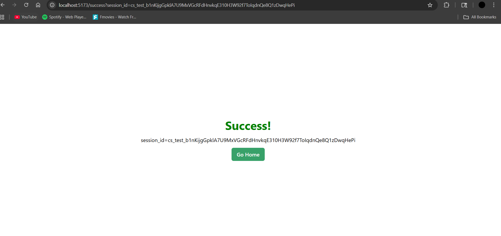

# Stripe Payment Gateway

Full-stack payment integration with React frontend and Spring Boot backend.

## Features
- Hosted Stripe Checkout
- Customer management
- Success/Failure page handling
- Responsive UI with Chakra UI

## Preview
### Home Page


### Payment Page


### Success Page


## Tech Stack
- **Frontend**: React, TypeScript, Vite, Chakra UI
- **Backend**: Spring Boot, Java
- **Payment**: Stripe API

## Setup

### Prerequisites
- Node.js 18+
- Java 17+
- Stripe account

### Backend Setup
1. Navigate to backend folder:
   ```bash
   cd backend
   ```

2. Set environment variables in your IDE or create `.env`:
   ```
   STRIPE_API_KEY=sk_test_your_stripe_secret_key
   CLIENT_BASE_URL=http://localhost:5173
   ```

3. Run the application:
   ```bash
   ./mvnw spring-boot:run
   ```

### Frontend Setup
1. Navigate to frontend folder:
   ```bash
   cd frontend
   ```

2. Install dependencies:
   ```bash
   npm install
   ```

3. Start development server:
   ```bash
   npm run dev
   ```

## Usage
1. Open http://localhost:5173
2. Click "Hosted Checkout"
3. Fill customer details
4. Complete payment with Stripe test cards

## Test Cards
- Success: `4242 4242 4242 4242`
- Decline: `4000 0000 0000 0002`

## Project Structure
```
├── backend/          # Spring Boot API
├── frontend/         # React application
└── README.md
```

## Environment Variables

### Backend
- `STRIPE_API_KEY`: Your Stripe secret key (starts with `sk_test_`)
- `CLIENT_BASE_URL`: Frontend URL (default: `http://localhost:5173`)

### Frontend
- `VITE_SERVER_BASE_URL`: Backend API URL (default: `http://localhost:8080`)

## API Endpoints

### POST /checkout/hosted
Creates a Stripe checkout session.

**Request Body:**
```json
{
  "items": [
    {
      "id": "shoe",
      "name": "Puma Shoes"
    }
  ],
  "customerName": "John Doe",
  "customerEmail": "john@example.com"
}
```

**Response:**
Returns Stripe checkout URL for redirect.

## Security Notes
- Never commit actual Stripe API keys to version control
- Use environment variables for sensitive configuration
- Test with Stripe test keys only in development

## Getting Stripe API Keys
1. Create account at https://stripe.com
2. Go to https://dashboard.stripe.com/test/apikeys
3. Copy the "Secret key" (starts with `sk_test_`)
4. Use this as your `STRIPE_API_KEY`

## Troubleshooting

### Common Issues
1. **"Site can't be reached" after payment**: Check `CLIENT_BASE_URL` matches your frontend port
2. **CORS errors**: Ensure backend has `@CrossOrigin` annotation
3. **Environment variables not found**: Verify they're set in your IDE run configuration

### Port Configuration
- Backend runs on: `http://localhost:8080`
- Frontend runs on: `http://localhost:5173` (Vite default)
- Make sure `CLIENT_BASE_URL` points to the correct frontend port

## License
MIT License